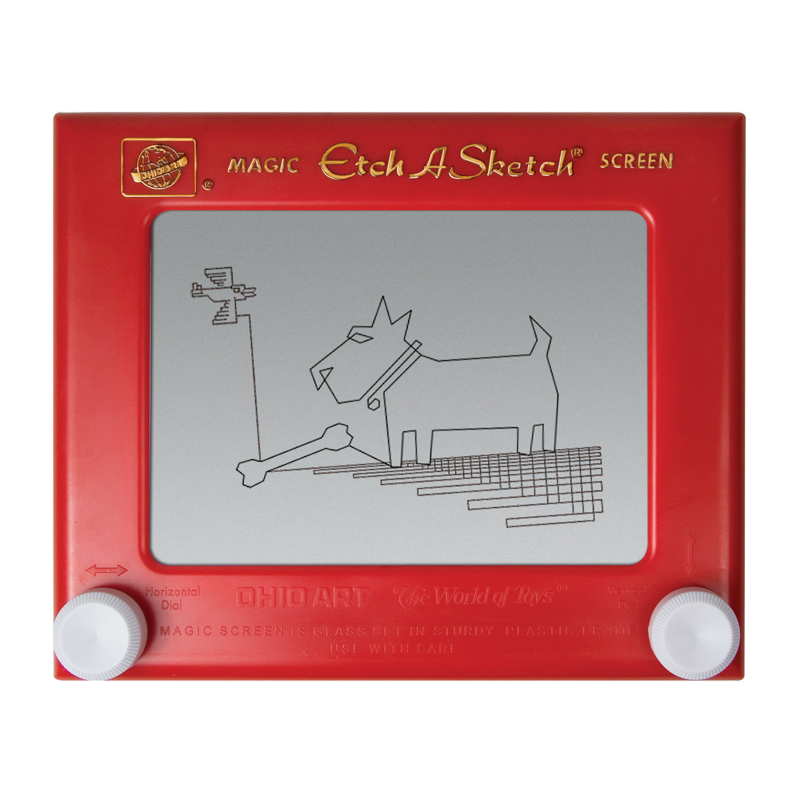

# Etch-A-Sketch App
We are trying to recreate this childhood game called Etch-A-Sketch by using a built-in drawing class in python. 
 

    

### Project Specifications:
Create a turtle object that allows you draw on a canvas by pressing:
- 'W' key to go forward
- 'S' key to go backwards
- 'A' key to go counter-clockwise (or leftwards)
- 'D' key to go clockwise (or rightwards)
- 'C' key to clear the drawing, and reset the turtle position to the center

### Learning outcomes:
- Using event listener
- Utilising turtle documentation to implement app